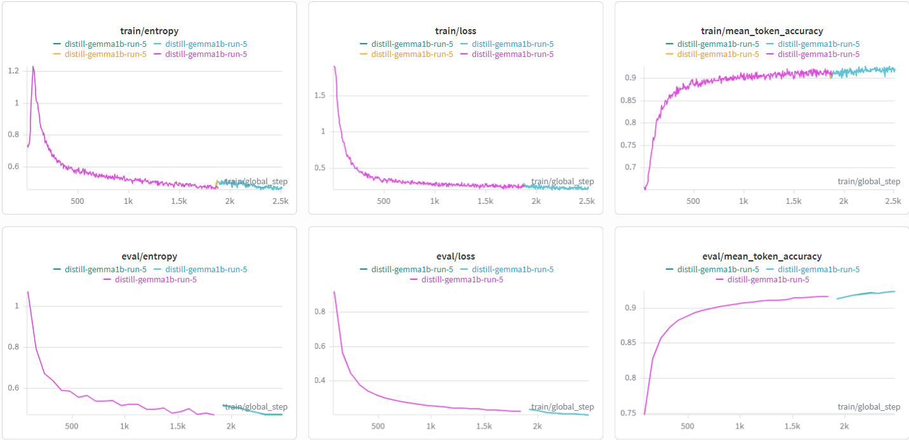
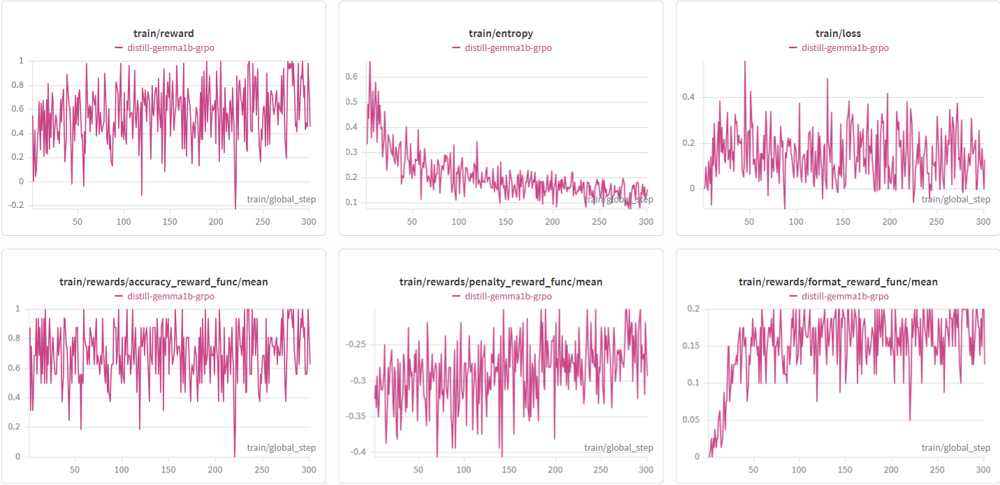

# Соревнование по дистилляции LLM
Научи маленькую модель решать математику

## Description
Обучить модель google/gemma-3-1b-it (студент) решать задачу Countdown, используя знания модели-учителя из другого семейства (например, Qwen3-8B, Llama-3.1-8B-Instruct, Mistral-7B-Instruct или любую другую открытую модель до 8B параметров).

Важное требование: учитель и студент должны иметь разные токенизаторы (принадлежать разным семействам моделей). Это ключевое ограничение задачи, которое необходимо учитывать при выборе метода дистилляции.

**Countdown** — математическая задача, в которой даны несколько чисел и целевое число. Нужно составить арифметическое выражение, используя данные числа и операции +, -, *, /, чтобы получить целевое число.

>**Пример:**
>
>Числа: [75, 80, 90, 24]
>Целевое число: 61
>
>Ответ: 90 - 80 + 75 - 24 = 61

## 📝Ход решения

Было проделано множество экспериментов с разными вариантами датасета: пробовал разные модели, разные подходы к созданию данных
**Пути создания датасета:**
1) Идея: создать строго структурированный датасет, чтобы модель училась решать задачу по шагам - по итогу ничего эта идея была обречена на провал, модель слишком много ресурсов тратила на поддержание формата, не научилась вычислениям и уходила в бесконечный цикл.
2) Идея: создать датасет на основе обычных рассуждений модели-учителя, также поставив на генерацию одного примера вариативность, чтобы для одного примера могло быть несколько путей решения - по итогу такой путь был чуть лучше, но также был обречен, модель в момент ответа совмещала решения, путалась и уходила в цикл.
3) Идея: создать датасет с одним решением на пример на основе обычных рассуждений, но сделать акцент на решении, поменьше "болтовни" - на нём я и остановился, сделал датасет из примерно 30к примеров.

Могу сказать, что по итогу ни один из этих трёх примеров не был верным, даже последний, который я и использовал был плох, всё же осталось много разговора, модели было сложно выучить саму "математику" и упёрлась в потолок своих возможностей.

Во всех трёх путях был применён метод **Rejection Sampling + SFT**, дообучал модель, используя **QLoRA**, только на правильных ответах.

## Попытка улучшить результат

Чтобы исправить проблемы **SFT** стадии, хотел научить модель решать математику с помощью подхода **GRPO** (метода обучения с подкреплением), идея была: используя уже существующий датасет, штрафовать и награждать модель за тот или иной аспект оценивания. Это хороший подход, но он хорошо работает на больших моделях, но Gemma на 1B  параметров слишком мала и от этого подхода лучше почти и не стала.

Лучшим решением, что было предсказуемо, это использовать подход **Test-Time Compute** для получения наилучшего результата я для каждого примера делал несколько решений и оставлял из всех правильный.

## Модели

[Чекпоинты для sft и grpo лежат на HuggingFace](https://huggingface.co/Nokish1/distillation-gemma)

## 📈Графики обучений

### SFT

### GRRPO

## Вывод

Задача была интересная, непростая в плане данных, наверное, нужно было подобрать такие данные, чтобы "глупая" gemma смогла научиться сложному, для такой маленькой модели, делу - **математике**. К сожалению, я допустил множество ошибок на этом пути, поэтому мой результат не является выдающимся. Главное - сделал вывод, нашёл свои ошибки и продолжаю развиваться в этой интересной сфере.
